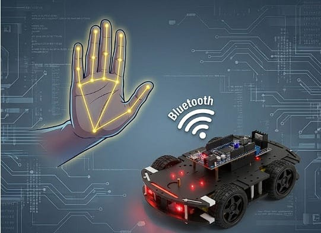

# STM32F407 RobotVF - UART Motor Control

Small firmware for an STM32F407VGT6 (LQFP100) that drives a differential-drive robot using four PWM outputs on TIM3 and a simple text command interface on USART3 (9600 bps, 8N1). Commands such as `AVANCE+`, `STOP`, `GAUCHE`, and `DROITE` set duty cycles on the four TIM3 channels to move the robot forward, stop, or turn.

## What this project does
- Initializes TIM3 with a 1 kHz PWM (prescaler 15, period 999) on PB0, PB1, PB4, PB5.
- Listens on USART3 (PB10/PB11) with interrupt-driven RX; each newline-terminated string is parsed.
- Maps French keywords to motor duty cycles via `__HAL_TIM_SET_COMPARE` in `Core/Src/main.c`.
- Uses only HAL and the internal HSI clock; no RTOS.

## Hardware at a glance
- MCU: STM32F407VGT6 (HSI clock, STM32Cube HAL).
- Motor driver: any dual H-bridge that can take four PWM inputs (for example L298N or L293D).
- UART link: PB10 (TX) / PB11 (RX) to a USB-UART dongle or Bluetooth module (HC-05 works) at 9600 bps, 8N1.
- Power: size your supply for both the MCU board and the motors; keep motor ground tied to MCU ground.

## Command set
| Command  | Effect on TIM3 channels (CH1/CH2/CH3/CH4) | Notes                    |
|----------|-------------------------------------------|--------------------------|
| AVANCE+  | 750, 0, 750, 0                            | Forward / both motors on |
| GAUCHE   | 1000, 0, 500, 0                           | Turn left                |
| DROITE   | 500, 0, 1000, 0                           | Turn right               |
| STOP     | 0, 0, 0, 0                                | All motors off           |

Tune duty cycles in `HAL_UART_RxCpltCallback` inside `Core/Src/main.c` to adapt speed or torque. With the current clocking, `compare = 1000` equals 100 percent duty.

## Building and flashing
1) Open `robotvf.ioc` in STM32CubeIDE (CubeMX 6.15.0, F4 HAL 1.28.3; STM32CubeIDE 1.15.x or newer is fine).
2) From STM32CubeIDE, use **Project > Build** to generate firmware (Debug configuration uses HSI at 16 MHz).
3) Connect ST-LINK to your STM32F407 board and **Run > Debug/Run** to flash.

## Running
1) Connect PB10/PB11 to your UART or Bluetooth module; share ground.
2) Open a serial terminal at 9600 bps, send one command per line (CR or LF accepted).
3) Observe the robot: the duty cycles update immediately after each newline.

## Repository layout (current state)
- `Core/`, `Drivers/`, `robotvf.ioc`: main STM32CubeIDE project.
- `Debug/`: generated build output (now ignored by git).
- `third_party/x-cube-n6-ai-hand-landmarks/`: vendor sample for STM32N6 hand-landmark AI (kept as reference).
- `third_party/x-cube-n6-ai-hand-landmarks-duplicate/`: spare copy of the same sample; remove if you don't need it.

Suggested tidy layout before pushing:
- Keep only the STM32F407 project in the root (or move it to `firmware/robotvf/`).
- Keep only one copy of the N6 demo (now `third_party/x-cube-n6-ai-hand-landmarks/`).
- Put any reports (for example your PDF) into `docs/`.
- Store project photos or diagrams in `docs/media/`.

## GitHub quick start
```bash
git init
git add .gitignore README.md Core Drivers robotvf.ioc .cproject .project STM32F407VGTX_FLASH.ld STM32F407VGTX_RAM.ld
git commit -m "Add STM32F407 robot controller firmware"
git branch -M main
git remote add origin <your-repo-url>
git push -u origin main
```
Avoid committing `Debug/` or the large STM32N6 sample if you do not need it.

## Configuration knobs
- PWM frequency: `f_pwm = 16 MHz / (Prescaler+1) / (Period+1) = 1 kHz` (set in `Core/Src/tim.c`).
- Command parser: edit `HAL_UART_RxCpltCallback` in `Core/Src/main.c` to add new verbs or change duty cycles.
- UART: 9600 bps 8N1 on USART3; adjust in `Core/Src/usart.c` if your link requires a different rate.

## AI hand-landmark reference (STM32N6 sample)
- The folder `third_party/x-cube-n6-ai-hand-landmarks/` contains ST's two-stage palm + hand-landmark demo for STM32N6 (palm detection then landmark regression, resized/rotated between stages).
- Official package: see ST's X-CUBE-N6-AI hand-landmarks sample on GitHub (https://github.com/STMicroelectronics/x-cube-n6-ai-hand-landmarks). If you publish this code, keep ST's license (LICENSE.md inside the folder).
- This sample is not used by the STM32F4 RobotVF firmware but can serve as a reference for AI deployment on STM32N6 boards.

## Demo
- Live demo video: <!--place your link here, for example `https://youtu.be/XXXXXXXXXXX`. -->
<!-- - If you publish binaries, add release assets on GitHub and link them here. -->

## Media



<!--Put your image file at `docs/media/robotvf-setup.jpg` (create the folder if it does not exist) and update the filename in the Markdown if needed. -->


